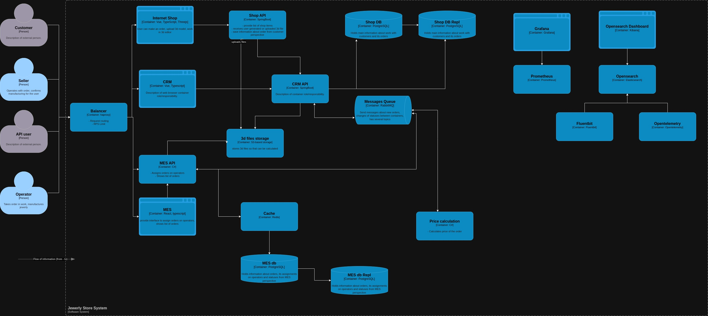

# Анализ, идентификация проблем и поиск решений

## Проблемы

- Ручно деплой release
- Ручной запуск тестов
- Нет балансировщика или API gateway
- На текущий момент все запускается в едином экземпляре
- Отсутсвет репликация
- Разнообразный стэк для такого проекта и команды.
- Отсутсвует централизованный сбор логов
- Отсутсвует мониторинг
- Отсутсвует трасировка
- Отсутсвует кэширование
- MES и CRM монолитные системы
- MES самая нагруженная часть архитектуры
- Нет описания как заказ из SHOP попадает к операторам.
- Отсуствует оповещение операторов о новом заказе
- Отсуствует нагрузочное тестирование

## Инициативы
- Выделить домены для дальнейшего планирования
    Это поможет в понимании контекста, планировании и выделении поддоменов в отдельный сервис
- Внедрить мониторинг
    Для комплексного понимания состояния системы. Позволит вовремя заметить серьезные проблемы, принять решение по их устранению и запланировать дополнительные работы или закупку мощностей.
- Внедрить сбор логов
    Для обнаружения ошибок в системе начиная с контура разработки и заведения задач на исправление. Понимание ошибок и их решение поможет стабилизировать ситуацию на проде.
- Внедрить балансировщик
    Для контроля запросов поступающих в систему и их маршрутизации. Поможет реализоват балансировку на ранних этапах и воспользоваться политиками лимитирования запросов к бэку.
- Внедрить дополнительный экземпляр MES
    Как временное решение для стабилизации работы. Т.к. MES является высоконагруженным компонентом, то создание дополнительного экземпляра поможем распределить нагрузку и выиграть время для реализации целевых мер по устранению проблемы.
- Внедрить репликацию
    Поможет распределить операции чтения и записи и повысит отказоустойчивость БД.
- Внедрить трассировку
    Поможет лучше понимать как проходят запросы через компоненты, в какой части происходят проблемы и задержки.
- Выделить некоторые домены в отдельные микросервисы по поттерну Strangler Fig
    MES является узким местом системы реализующий большую часть ключевого функционала. Выделение на раннем этапе расчета стоимости поможет вынести значительную часть нагрузки из MES.
- Внедрить кэширование
    Поможет снизить нагрузку на систему без координальных изменений
- Переделать взаимодействие компонентов системы
    Shop должен создавать заказы в CRM через API, это поможет избежать проблем с потерей заказов, когда информация просто добавляется в БД.
- Внедрить нагрузочное тестирование
    На ранних этапах поможет выявить проблемы с производительностью и собрать фактуру.
- Запуск тестов в конвейере CI
    Ускорит процесс разработки в целом и освободит время QA на другие задачи и позволит выявлять проблемы на стадии разработки.
- Автоматический деплой в контур release
    Всегда только актуальные вресии прошедшие обновленя.
- Внедрить Autoscaling
    Помомжет масштабировать компоненту по мере роста нагрузки.

Из указанного списка можно выделить следующие 3 задачи
1. Observability
    - Мониторинг
    - Логирование
2. Внедрение балансировщика
3. Внедрение дополнительного экземпляр MES

