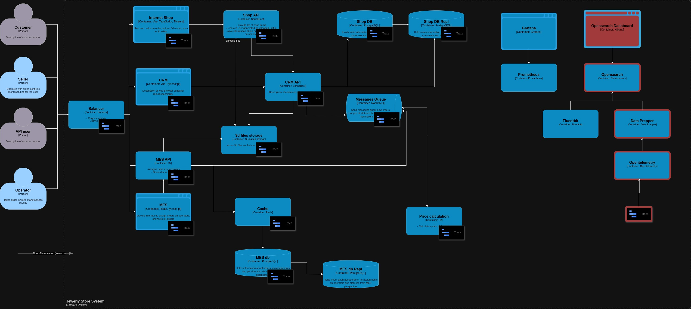

# Архитектурное решение по трейсингу

## Планирования трейсинга

Трассировку необходимо получать со всех компонентов, чтобы получить полную картину по тому как запрос проходит в системе на каждом этапе.

Контекст операции:
- Наименование ноды
- IP-адрес нода
- Путь к api-методу(url запроса)
- Время выполнения запроса
- Код ответа
- trace_id
- span_id
- ID клиента
- ID заказа

## Мотивация

Внедрение трассировки позовлит быстрее локализовать проблему и ответить на вопросы:

- На какой ноде проблема
- С каким запросом проблема
- У каких пользователей проблема
- С каким заказом проблема
- На каком компоненте проблема

и используя данную информацию совместно с логами и мониторингом можно воссоздать полную картину происходящего.

Метрики:
- SLO, SLI. Трейсинг позволяет быстрее обнаружить проблему и заняться ее устранением, а так же выявить проблему раньше чем это заметят пользователи системы.
- Необработанные заказы в срок. Обнаруженные проблемы благодоря трассировке помогут обратить внимание на проблемы с определенными заказами и с заказами в целом.
- Производительность системы и пользовательский опыт. Внедрение трассировки позволит обнаружеить узки места в производительности тем самым улучшив пользовательский опыт.

## Предлагаемое решение

Для сбора трассировки будет внедрен следующий стэк технологий:
 - OpenSearch - система агрегации и визуализации полученной информации
 - Data Prepper - коллектор, обрабатывает и преобразовывает полученные данные для использования из в OpenSearch
 - OpenTelemetry Collector - коллектор, получает данные от приложений и формирует из в формат OpenTelemetry

## Компромиссы

Внедрение трассировки будет спорным решением когда:
- Монолитная архитектура.
- В MVP или небольшой стартап.
- Не во все компоненты можно внедрить трассировку.
- Различные системы которые могут быть в изолированных контурах и отправка данных в коллектор затруднена.
- Используются проперитарные протоколы в которых нельзя встроить дополнительную информацию в запросы или как токовые запросы отсудтсвеют.

## Аспекты безопасности

Меры для предотвращения несанкционированного доступа:
- Доступ только из определенных подсетей или адресов внутренней сети.
- Доступ на основе ролевой модели.
- Аутентификация.
- Маскирование или обезличивание кретичных данных в отдельном индексе или инстансе OpenSearch.
- Логирование действий сотрудников в OpenSearch.
- Использование только персональных УЗ из централизованного каталога(например Active Directory)