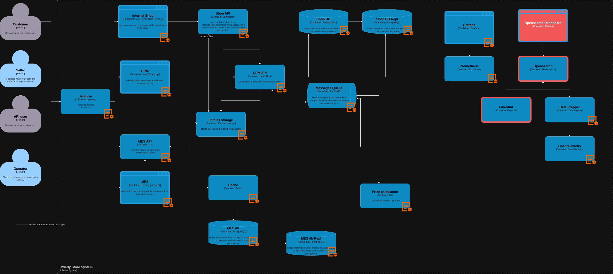

# Архитектурное решение по логированию

## Планирования логирования

Собирать лони необходимо по всем компонентам системы.

Список логов INFO:
- Поступление запроса на балансировщие
    - IP
    - Заголовки
    - Время поступления запроса
    - Код ответа
    - URL
    - Вресия протокола
- Статус заказа
    - Время изменения
    - С какого статуса на какой
    - Причина изменения статуса
    - ID заказа
    - Сущность изменившая статус закаща
- Статус оплаты
    - Время изменения
    - ID заказа
    - ID оплаты
    - Сущность изменившая статус заказа
- Статус подсчета стоимости заказа
    - Время изменения
    - Сущность изменившая статус заказа
    - ID заказа
- Запуск или остановка компонента
    - Время события
    - Как был инициирован процесс запуска или остановки

Оставшиеся уровни логирования:
- Warning - позволит обратить внимание на нестандартное поведение компонента системы.
- ERROR - явная обработанная ошибка в работе компонента.
- CRITICAL - критическая ошибка в работе компонента и дальнейшая работоспособность не может быть продолжена.
- DEBUG - на стендах тестирования и разработки позволит писать в лог дополнительную информацию для отладки. На продуктивном стенде включение данного уровня может сильно повлиять на производительность компонентов.

## Мотивация

Логирование позволит команде проекта разобраться с чем связана возникшая проблема, а так же какие события предществовали ей. Без централизованной агрегации, хранения и визуализации невозможно оперативно определить причину появления проблемы. Так же данную инфомрацю можно использовать для анализа в целях улучшения системы.

Метрики:
- SLO, SLI. Логирование позволяет быстрее обнаружить проблему и заняться ее устранением, а так же выявить проблему раньше чем это заметят пользователи системы.
- Необработанные заказы в срок. Обнаруженные проблемы благодоря логированию помогут обратить внимание на проблемы с определенными заказами и с заказами в целом.
- Контроль безопасности системы, анализируя логи можно выявить попытку атаки на систему, предотвратив это можно сохранить активы компании.

Настройка логирования или трейсинга на части компонентов не имеет преимуществ, в первую очередь нужно настроить логирование, а потом как часть развития наблюдаемости начать внедрение трейсинга.

## Предлагаемое решение

Для сбора трассировки будет внедрен следующий стэк технологий:
 - OpenSearch - система агрегации и визуализации полученной информации.
 - Fluentbit - коллектор логов для сбора, парсинга и преобразования данных и отправки систему хранения.

## Аспекты безопасности

Меры для предотвращения несанкционированного доступа:
- Доступ только из определенных подсетей или адресов внутренней сети.
- Доступ на основе ролевой модели.
- Аутентификация.
- Маскирование или обезличивание кретичных данных в отдельном индексе или инстансе OpenSearch.
- Логирование действий сотрудников в OpenSearch.
- Использование только персональных УЗ из централизованного каталога(например Active Directory).
- Чувствительные денные и технически в раздельных индексах или инстансах.
- Технически данные можно хранить в основном храшилище 20 дней, затем перемещать в холодное хранилище на 2 месяца. Следует использовать Datastream.
- Чувствительные данные в основном храшилище можно хранить 3 месяцы, делее перемещать в холодное хранилище на 1 год. Следует использовать Datastream.

## Система анализа логов

Алерт нужно настоить по следующим событиям:
- Коллечество неверных аутентификаций
- Колличество общих ошибок
- Колличество ошибок с заказами
- На определенные ошибки с заказами
- Критические ошибки
