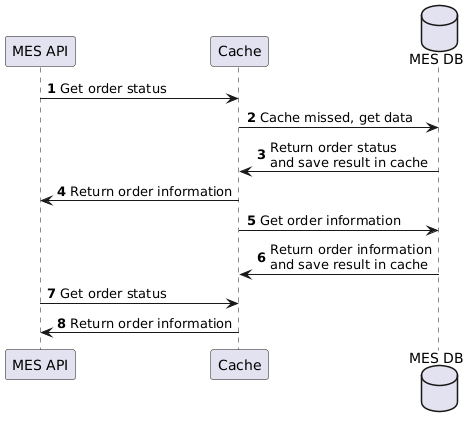

# Архитектурное решение по кешированию

## Мотивация

Кэширование нужно для обеспечения производительности и стабильности самых нагруженных компонентов системы.

Подключить к кэшированию необходимо самый нагруженный компонент системы(MES)

## Предлагаемое решение

Лучшим вариантом будет внедрение клиентского и серверного кэширования.

Наиболее оптимальным решением будет внедрение паттерна Refresh-Ahead, т.к. компонент MES создает больше операций чтения по отношению к записи. Данный паттерн выбран, т.к. важно получать актуальную информацию о заказах т.к. имеется множество бизнес интеграций.

## Предлагаемое решение

В данной ситуации следует выбрать инвалидацию по ключу, т.к. информация о заказе изменяется не часто и можно точечно обновлять информацию в кэше о конкретном заказе. Данная стратегия эконопит ресурсы при обновлении данных в кэше.
Остальные не подойдут по следующим причинам:
- Временная инвалидация - до обновления может отдавать неактуальные данные, что может привести кошибкам взять заказ в работу операторами, обновление информации о всех заказах приведет к неоптимальному использованию ресурсов.
- Инвалидация, основанная на запросах - нет надобности инфвалидировать кэш на основе запросов, только по факту изменения информации о заказе.
- Программная инвалидация - сценарий кэширования информации о заказах не требует сложного процесса инфвалидации.
- Инвалидация на основе изменений - нет необходимости при изменении данных одного заказа обновлять информацию в кэше об остальных.